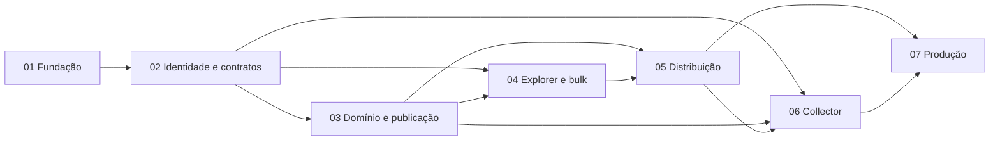

# Collections e Payload CMS — Implementation Plan

> **For agentic workers:** REQUIRED SUB-SKILL: Use superpowers:subagent-driven-development (recommended) or superpowers:executing-plans to implement this plan task-by-task. Steps use checkbox (`- [ ]`) syntax for tracking.

**Goal:** Entregar Collections versionadas, um Admin Payload CMS operável em escala Gmail, distribuição autenticada e integração segura no Collector sem transferir o ownership de Curations/Entities ao CMS.

**Architecture:** A entrega é dividida em sete planos que deixam software testável ao final de cada fase. Payload escreve somente `concierge-cms`; FastAPI continua escrevendo o banco operacional e expõe contratos explícitos; Collector consome apenas leitura publicada e a porta única de operações individuais do Payload.

**Tech Stack:** Node.js 22, npm workspaces, Payload 3.86.0, Next.js 16.2.12, React 19.2.6, TypeScript, Vitest, Playwright, FastAPI 0.115.5, Pydantic 2.10.3, PyMongo 4.9.0, MongoDB Atlas, vanilla JavaScript/ModuleWrapper, Render.

**Spec:** `docs/superpowers/specs/2026-08-18-collections-payload-cms-design.md`

## Global Constraints

- Collection é um agregado N:N próprio; nunca adicionar `collection`, `rank`, `position` ou ordem editorial a Curation.
- Versão congela metadata da Collection e membership de IDs; Curation e Entity continuam live em produção.
- Slug torna-se imutável e reservado após o primeiro publish.
- Draft usa delta, revisão, epoch e promoção por ponteiro; nenhum browser ou documento contém arrays com o universo de membros.
- Payload/worker têm read-write somente em `concierge-cms`; FastAPI tem read-write operacional e read-only na projeção CMS.
- Toda mutação de membership, inclusive a individual do Collector, cria uma operação pela mesma porta, com `Idempotency-Key` e `If-Match`.
- Role autoritativo é `users.role` do FastAPI; Admin revalida `authorized=true` e `role=admin` a cada request e checkpoint mutável.
- Collections são online-only; não tocar em schema Dexie, DataStore ou sync queue.
- Distribuição usa DTO allowlisted; nunca serializar documentos Mongo/Payload crus.
- Jobs e publish são retomáveis, usam lease e fencing, e promovem estado somente por CAS/transação curta.
- Node é `>=22 <23`; existe um único `package-lock.json` na raiz; não introduzir Nx, Turborepo, GraphQL, rich text ou uploads na v1.
- Cada fase deve terminar com os gates indicados abaixo e um commit focado; não avançar com teste vermelho.

---

## Ordem de execução



| Ordem | Plano | Resultado demonstrável | Gate principal |
|---|---|---|---|
| 1 | [`2026-08-18-collections-01-foundation.md`](2026-08-18-collections-01-foundation.md) | Workspace npm, Admin Payload, banco CMS isolado, shell e worker oficial | Collector legado + unit/typecheck/build Admin |
| 2 | [`2026-08-18-collections-02-auth-contracts.md`](2026-08-18-collections-02-auth-contracts.md) | Handoff one-shot, sessão host-only, introspecção e cliente TS gerado | Pytest auth/contract + Vitest auth + replay/downgrade |
| 3 | [`2026-08-18-collections-03-domain-publishing.md`](2026-08-18-collections-03-domain-publishing.md) | CRUD, delta, operações, versões, publish, archive/restore | Unit/integration/concurrency de domínio e worker restart |
| 4 | [`2026-08-18-collections-04-explorer-bulk.md`](2026-08-18-collections-04-explorer-bulk.md) | `catalog_sequence`, Explorer virtualizado, manifests e bulk multi-target | Scan high-water, 50k itens, seleção/retry/cancelamento |
| 5 | [`2026-08-18-collections-05-distribution.md`](2026-08-18-collections-05-distribution.md) | Apps/credentials, paginação autenticada e dumps NDJSON | 401/404/410/409/429, live hydration, stream interrompido |
| 6 | [`2026-08-18-collections-06-collector-integration.md`](2026-08-18-collections-06-collector-integration.md) | Botão/modal em todo card e operação individual admin | Vitest UI/a11y/offline + E2E Collector→Payload |
| 7 | [`2026-08-18-collections-07-production-hardening.md`](2026-08-18-collections-07-production-hardening.md) | Observabilidade, retenção, Blueprint, quality gate e rollout | CI/local quality, staging E2E/carga/caos/backup-restore |

## Registro de interfaces entre fases

Estes nomes são canônicos. Uma fase que precisar alterá-los deve atualizar todos os planos dependentes antes de implementar.

```typescript
export type UserRole = 'viewer' | 'curator' | 'admin'

export interface ActorAuthorization {
  userId: string
  email: string
  role: UserRole
  authorized: boolean
  authzRevision: string
}

export interface CmsIdentity extends ActorAuthorization {
  name: string
  picture: string | null
}

export type CollectionLifecycle = 'draft' | 'published' | 'archived'
export type DraftState = 'clean' | 'dirty' | 'publishing' | 'failed'
export type DraftOperationAction = 'add' | 'remove'
export type SelectionMode = 'explicit' | 'all_matching'

export interface CreateDraftOperationCommand {
  collectionId: string
  mode: 'explicit' | 'selection'
  action: DraftOperationAction
  curationIds?: string[]
  selectionId?: string
  baseDraftRevision: number
  idempotencyKey: string
  requestHash: string
  actor: ActorAuthorization
}
```

```python
class CmsAuthorization(BaseModel):
    user_id: str
    email: EmailStr
    name: str
    picture: str | None
    role: Literal["viewer", "curator", "admin"]
    authorized: bool
    authz_revision: str

class CatalogCursor(BaseModel):
    catalog_sequence: int
    curation_id: str

class AvailabilityReason(str, Enum):
    CURATION_MISSING = "curation_missing"
    CURATION_NOT_PUBLIC = "curation_not_public"
    MISSING_ENTITY = "missing_entity"
    ENTITY_NOT_PUBLIC = "entity_not_public"
    SCHEMA_INVALID = "schema_invalid"
```

Rotas canônicas:

```text
GET  /api/v3/auth/cms/authorize
POST /api/v3/auth/cms/exchange
POST /api/v3/auth/cms/introspect
POST /api/v3/auth/cms/introspect-bearer
GET  /api/v3/catalog/curations
POST /api/v3/catalog/curations/resolve
POST /api/v3/catalog/curations/scan/start
POST /api/v3/catalog/curations/scan/page
POST /api/v3/internal/curations/hydrate
GET  /api/v3/internal/consumer-usage
GET  /api/v3/curations/{curation_id}/collections

POST /api/admin/v1/selections
GET  /api/admin/v1/selections/{selection_id}
POST /api/admin/v1/selections/{selection_id}/exports
GET  /api/admin/v1/exports/{export_id}
GET  /api/admin/v1/curations/{curation_id}/collection-options
POST /api/admin/v1/collections/{collection_id}/draft/operations
GET  /api/admin/v1/operations?actor=current&active=true
GET  /api/admin/v1/operations/{operation_id}
POST /api/admin/v1/operations/{operation_id}/cancel
POST /api/admin/v1/collections/{collection_id}/publish
POST /api/admin/v1/collections/{collection_id}/archive
POST /api/admin/v1/collections/{collection_id}/restore
POST /api/admin/v1/collections/{collection_id}/versions/{version}/restore-as-draft
GET  /api/admin/v1/applications
POST /api/admin/v1/applications
PATCH /api/admin/v1/applications/{application_id}
POST /api/admin/v1/applications/{application_id}/credentials
POST /api/admin/v1/credentials/{credential_id}/rotate
POST /api/admin/v1/credentials/{credential_id}/revoke

GET /api/v3/distribution/collections/{slug}
GET /api/v3/distribution/collections/{slug}/versions
GET /api/v3/distribution/collections/{slug}/versions/{version}
GET /api/v3/distribution/collections/{slug}/dump
GET /api/v3/distribution/collections/{slug}/versions/{version}/dump
```

## Matriz de cobertura da especificação

| Seções da spec | Plano/tarefas responsáveis |
|---|---|
| §§4–6: invariantes, ownership, bancos, repo e deployables | 01 Tasks 1–4; 07 Tasks 3–4 |
| §§7.1–7.4: Collection, intervals, delta e versions | 03 Tasks 1–5 |
| §§7.5, 12: manifests, Explorer e operações | 04 Tasks 1–6 |
| §§7.6, 10: applications, credentials e distribuição | 05 Tasks 1–5 |
| §§7.7, 12.2: índices e `catalog_sequence` | 03 Task 1; 04 Tasks 1–2 |
| §8: publish, histórico, archive/restore | 03 Tasks 4–6 |
| §9: conteúdo live e disponibilidade | 05 Task 3 |
| §11: Admin, visual e fundação CMS | 01 Tasks 2–4; 03 Task 6; 04 Task 3 |
| §13: card/modal/permissões/online-only | 06 Tasks 1–4 |
| §§14–15: handoff, revalidação e contratos | 02 Tasks 1–5 |
| §§16–18: erros, segurança, observabilidade e retenção | 02–06 nos contratos; 07 Tasks 1–3 |
| §19: unit, integração, concorrência, E2E, carga e caos | todos os planos; 07 Task 5 agrega evidência |
| §§20–22: migration, rollout, rollback e aceite | 07 Tasks 3–5 |

## Checkpoints de produto

- Após 02: demonstrar login no Admin sem JWT na URL, cookie compartilhado ou segredo HS256 no Payload.
- Após 03: publicar uma Collection de teste, editar seu draft e provar que a versão atual não mudou.
- Após 04: selecionar todos os resultados de uma busca de 50.000 Curations sem enviar IDs pelo browser.
- Após 05: revogar uma credential e observar `401` na requisição seguinte; editar uma Curation e observar mudança live sem publish.
- Após 06: viewer consulta associações; admin cria operação; offline não toca Dexie nem sync queue.
- Antes de produção: todos os gates de 07 e os vinte critérios de aceite da spec têm evidência anexada ao runbook de rollout.
