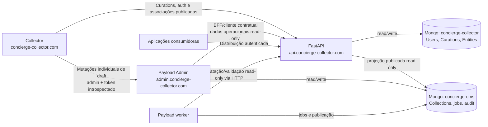
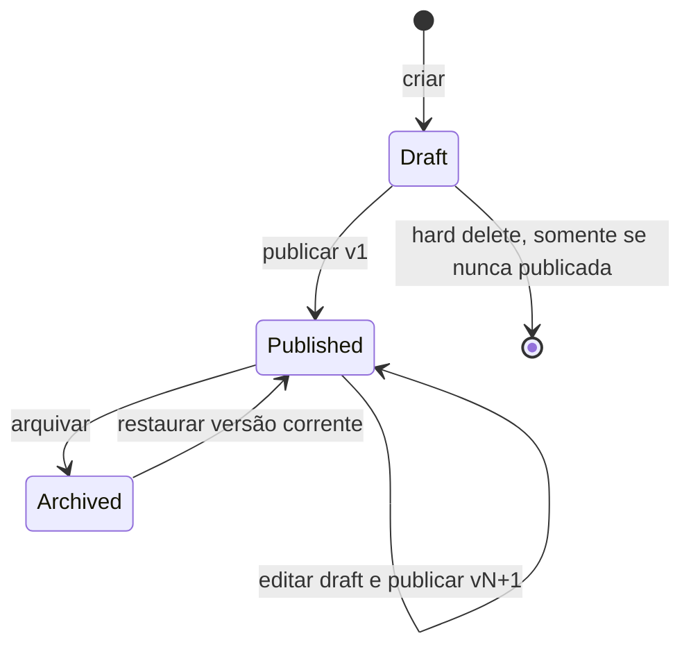

# Design — Collections e fundação do Payload CMS

**Data:** 2026-08-18

**Status:** desenho aprovado em conversa; aguardando revisão deste documento

**Escopo:** introduzir Collections como seleção versionada de curadorias, criar o Admin em Payload CMS e estabelecer a fundação evolutiva de um CMS completo.

## 1. Resumo executivo

Collection é um agregado editorial próprio. Ela não é uma categoria nem um campo da Curation: é uma seleção global, sem ordem, de zero a dezenas de milhares de Curations destinada a aplicações consumidoras diferentes.

O sistema terá duas superfícies complementares:

- `concierge-collector.com` continua sendo o Collector atual. Cada card de Curation ganha uma ação **Collections**. Qualquer usuário autenticado pode consultar associações publicadas; somente `admin` pode adicionar ou remover aquela Curation em drafts existentes.
- `admin.concierge-collector.com` será um novo Admin baseado em Payload CMS. Ele concentra criação e administração de Collections, seleção em massa estilo Gmail, publicação, versões, aplicações consumidoras, credenciais, jobs e auditoria.

Payload será a autoridade de escrita do novo domínio editorial. FastAPI continuará sendo a autoridade de Users, Curations, Entities, autenticação e distribuição externa. Os dois serviços usam bancos lógicos e credenciais diferentes, mesmo que inicialmente compartilhem o mesmo cluster MongoDB Atlas.

Uma versão publicada congela o estado que pertence à Collection: seus metadados editoriais e a seleção de IDs de Curation. Ela **não** congela os documentos Curation ou Entity. Alterações nesses documentos aparecem imediatamente nas respostas de produção; itens apagados, arquivados ou indisponíveis deixam de ser distribuídos imediatamente, sem criar uma nova versão da Collection.

## 2. Objetivos

1. Criar, editar, publicar, arquivar, restaurar e consultar Collections globais.
2. Manter múltiplas versões publicadas e imutáveis da seleção de membros.
3. Permitir milhares de inclusões e remoções em draft sem copiar arrays gigantes.
4. Entregar um Explorer de Curations com busca, filtros e seleção em massa comparável ao Gmail.
5. Distribuir dados públicos completos e normalizados por APIs autenticadas, com paginação e dump.
6. Usar credenciais individuais, revogáveis e com escopo por aplicação consumidora.
7. Manter o Collector atual estável e preservar seus fluxos offline de captura e edição.
8. Criar capacidades reutilizáveis — identidade, permissões, Explorer, jobs e auditoria — para a evolução gradual do Admin em CMS de todo o banco.
9. Preservar uma autoridade única de escrita para cada agregado e contratos claros entre serviços.

## 3. Não objetivos da primeira entrega

- Versionar ou copiar o conteúdo de Curation ou Entity.
- Introduzir ordem, posição, ranking ou sequência entre membros de uma Collection.
- Permitir criação de Collection dentro do Collector.
- Editar em massa os próprios campos das Curations; o primeiro conjunto de ações em lote é adicionar/remover de drafts e exportar.
- Tornar Collections disponíveis offline ou armazená-las no IndexedDB.
- Dar ao Payload acesso de escrita direto às coleções Mongo legadas.
- Migrar o frontend vanilla da raiz para React/Next ou reorganizar agora `concierge-api-v3/`.
- Criar módulos vazios de Curations, Entities ou Users apenas para antecipar o CMS futuro.
- Oferecer merge editorial automático de operações concorrentes sobre o mesmo draft.

## 4. Princípios e invariantes

1. **Collection é uma seleção:** membership é N:N entre Collection e Curation.
2. **Sem sequência:** a API pode usar uma ordenação técnica estável para paginar, mas essa ordem não tem significado editorial nem é versionada.
3. **Versão de Collection, não de Curation:** uma nova versão preserva seleção e metadados próprios; a hidratação de Curation/Entity permanece viva.
4. **Publicação explícita:** mudanças em draft nunca chegam à distribuição antes de um novo publish concluído.
5. **Produção atômica:** uma publicação só se torna visível pela troca final de um ponteiro; nunca há versão publicada parcialmente.
6. **Sem arrays gigantes:** memberships, deltas, manifests e resultados vivem em documentos indexados próprios.
7. **Browser não carrega o universo:** listas e filtros são server-side; “selecionar tudo” não envia milhares de IDs pelo navegador.
8. **Online-only:** operações de Collection falham de modo claro quando não há rede e nunca entram na fila offline existente.
9. **Menor privilégio:** nenhum runtime tem escrita nos dois bancos lógicos.
10. **Admin é autoridade de permissão:** esconder controles na UI não substitui RBAC no servidor.
11. **Operações retomáveis:** toda mutação em lote ou publicação é idempotente, auditável e possui checkpoint persistido.
12. **CMS evolui por agregados:** futuros recursos legados entram pelo FastAPI até que uma migração explícita transfira integralmente seu ownership.

## 5. Arquitetura de alto nível



### 5.1 Ownership

| Domínio | Autoridade de escrita | Leitores adicionais |
|---|---|---|
| Users, roles e autorização | FastAPI | Payload por introspecção/espelho mínimo |
| Curations e Entities | FastAPI | Payload Admin por API read-only |
| Collections e drafts | Payload | FastAPI por projeção read-only |
| Versions e memberships | Payload/worker | FastAPI distribution |
| Consumer applications e credentials | Payload | FastAPI por projeção/read-only |
| Distribuição pública autenticada | FastAPI | aplicações consumidoras |
| Audit e estado de jobs CMS | Payload/worker | Admin |

Payload nunca escreve `users`, `curators`, `curations` ou `entities`. FastAPI nunca cria ou altera documentos de Collection. Uma chamada encaminhada pelo FastAPI não altera essa regra: a mutação sempre termina num endpoint e numa regra de domínio do Payload.

### 5.2 Bancos e credenciais

O primeiro deployment usa o mesmo cluster Atlas com dois bancos lógicos:

- `concierge-collector`: banco operacional existente.
- `concierge-cms`: banco novo do Payload.

Credenciais mínimas:

| Principal | Permissões |
|---|---|
| `fastapi-runtime` | read/write no operacional; read na projeção CMS necessária à distribuição |
| `payload-web` | read/write somente no CMS |
| `payload-worker` | read/write somente no CMS |
| `cms-migration` | migration e índices somente no CMS, usada apenas no release step |
| backup/analytics | identidades separadas e read-only quando aplicável |

O worker obtém dados live por API interna FastAPI autenticada; ele não recebe credencial Mongo operacional.

## 6. Organização do repositório

O repositório torna-se um monorepo incremental. A raiz atual não é movida.

```text
Concierge-Collector/
├── index.html                         # Collector vanilla existente
├── scripts/                           # Collector existente
├── styles/                            # Collector existente
├── tests/                             # testes do Collector existente
├── capture/                           # captura offline existente
├── concierge-api-v3/                  # FastAPI existente
├── apps/
│   └── admin/                         # Next.js + Payload CMS
│       ├── app/                       # rotas Payload/Next
│       ├── src/
│       │   ├── auth/
│       │   ├── collections/
│       │   ├── explorer/
│       │   ├── bulk-operations/
│       │   ├── distribution/
│       │   ├── jobs/
│       │   └── audit/
│       ├── payload.config.ts
│       └── package.json
├── packages/
│   ├── fastapi-client/                # cliente TS gerado de contrato explícito
│   └── design-tokens/                 # tokens compartilháveis, não componentes React
├── contracts/
│   ├── openapi/
│   └── json-schema/
├── docs/
├── package.json                       # workspace root + app legado
├── package-lock.json                  # lockfile único
└── render.yaml                        # quatro deployables independentes
```

Decisões do workspace:

- Usar npm workspaces: `apps/*` e `packages/*`.
- Manter um único `package-lock.json` na raiz.
- Marcar o pacote raiz como `private`.
- Pin de Node único para root, Admin e deploy; a implantação inicial usa Node 22 LTS e uma versão de Payload compatível fixada no lockfile.
- Não introduzir Nx ou Turborepo nesta fase.
- Não tentar compartilhar componentes entre o frontend vanilla e React. Compartilhar tokens e contratos.
- Criar pacotes somente quando houver consumidor real; diretórios vazios não fazem parte da entrega.

### 6.1 Deployables

1. Collector static site, publicando a raiz.
2. FastAPI web service, com root `concierge-api-v3`.
3. Payload web service, com root `apps/admin`.
4. Payload worker, usando o mesmo código e a mesma revisão do Admin, mas executando apenas o runner de jobs.

Cada serviço tem build filter, health check, segredos e rollback independentes. Migrations rodam uma vez num release step com lock; nunca no boot concorrente de todas as réplicas.

Esta arquitetura escolhe **versionar a infraestrutura em `render.yaml`**. Os dois serviços atuais, hoje configurados manualmente, são inventariados e migrados de forma controlada para a configuração versionada; nomes, domains e IDs existentes não são recriados sem um plano explícito. Segredos continuam no secret manager/dashboard e aparecem no arquivo apenas como nomes/referências. Staging valida o Blueprint antes de qualquer adoção em produção.

## 7. Modelo de domínio

### 7.1 Collection

Campos conceituais:

| Campo | Semântica |
|---|---|
| `id` | identificador interno imutável |
| `slug` | identificador externo único; imutável após o primeiro publish |
| `title`, `description` | metadados editoriais próprios da Collection |
| `lifecycle` | `draft`, `published` ou `archived` |
| `current_published_version` | número/ID da versão corrente ou `null` |
| `draft_base_version` | versão publicada que originou o draft atual |
| `draft_epoch` | identificador imutável da geração atual do draft |
| `draft_revision` | ponteiro monotônico para a revisão visível do delta |
| `draft_state` | `clean`, `dirty`, `publishing` ou `failed` |
| `published_selected_count` | quantidade selecionada na versão publicada corrente |
| `draft_selected_count` | quantidade resultante da revisão visível do draft |
| `revision` | controle otimista para metadata e transições |
| audit fields | ator e timestamps de criação/alteração/publicação/arquivamento |

Regras:

- Slug é reservado para sempre depois do primeiro publish, inclusive quando a Collection é arquivada.
- Collection nunca publicada pode ser apagada definitivamente por admin.
- Collection publicada não pode ser hard-deleted; somente arquivada.
- Restaurar uma Collection arquivada reativa exatamente a mesma versão corrente.
- Collection arquivada é read-only no Admin até ser restaurada.
- Editar metadata ou membership de uma Collection publicada cria ou reutiliza o próximo draft baseado na versão corrente.

### 7.2 Membership versionado

`collection_memberships` usa intervalos de validade por versão:

```text
collection_id
curation_id
added_in_version
removed_in_version | null
created_by
created_at
```

Uma Curation pertence à versão `V` quando:

```text
added_in_version <= V
AND (removed_in_version IS NULL OR removed_in_version > V)
```

Uma remoção fecha o intervalo na nova versão. Uma reentrada posterior cria novo intervalo; não reabre nem reescreve o histórico anterior. Não existe campo de posição/rank.

Índices mínimos:

- `(collection_id, added_in_version, removed_in_version)` para resolver uma versão.
- `(collection_id, curation_id, added_in_version)` unique para impedir o mesmo intervalo duplicado.
- `(collection_id, curation_id)` unique parcial quando `removed_in_version = null`, garantindo no máximo um intervalo aberto por par.
- `(curation_id, collection_id, removed_in_version)` para o modal de uma Curation.

Além dos índices, o commit valida sob a serialização/CAS da Collection que nenhum intervalo novo sobrepõe outro intervalo histórico do mesmo par. Fechar e abrir intervals usa writes idempotentes vinculados ao publish job.

### 7.3 Draft delta

`collection_draft_changes` contém apenas a intenção líquida `add` ou `remove` em relação à versão publicada base. Não existe cópia integral dos membros.

Cada mudança contém:

```text
collection_id
curation_id
desired_state: add | remove
base_published_version
draft_epoch
base_draft_revision
target_draft_revision
operation_id
operation_sequence
valid_until_draft_revision | null
```

Há uma única linha por `(operation_id, curation_id)`. A projeção visível filtra `draft_epoch = collection.draft_epoch` e seleciona somente mudanças de operações committed cujo intervalo contém `collection.draft_revision`; para um mesmo `curation_id`, prevalece a maior revisão committed. Operações posteriores são rebased pelo servidor, em ordem, sobre a revisão anterior já committed. Um `If-Match` vindo do browser que não corresponda à revisão vigente retorna `409`; não ocorre merge implícito de uma base stale.

Para tornar uma operação grande visível de uma vez, mudanças de staging são vinculadas a uma revisão futura do draft. Enquanto `collection.draft_revision` aponta para `D`, linhas preparadas para `D+1` permanecem invisíveis. Depois de todos os lotes e validações, um compare-and-swap move o ponteiro para `D+1`.

Isso permite:

- processar dezenas de milhares de mudanças sem uma transação Mongo longa;
- preservar o draft anterior após crash ou cancelamento;
- evitar cópia de todos os membros;
- tornar a operação inteira visível por uma atualização final curta.

Tabela de convergência do delta líquido:

| Estado publicado | Delta visível | Nova ação | Delta resultante |
|---|---|---|---|
| ausente | nenhum | add | add |
| presente | nenhum | remove | remove |
| ausente | add | remove | nenhum |
| presente | remove | add | nenhum |
| qualquer | mesmo estado pedido | add/remove | `skipped`, sem nova mudança líquida |

### 7.4 Collection version

`collection_versions` é imutável e armazena:

- `collection_id` e número da versão;
- snapshot dos pequenos metadados próprios da Collection;
- contagem de membros selecionados;
- hash canônico da seleção de IDs;
- referência da publicação/job;
- `published_at` e `published_by`;
- versão do schema de distribuição.

O documento não contém array de membros nem snapshot de Curation/Entity.

A distribuição lê título/descrição do `collection_versions` publicado, nunca do documento editável da Collection. Assim, uma alteração de metadata também permanece em draft até publish.

O membership hash é `SHA-256` sobre um domain separator, `schema_version` e a sequência UTF-8 de `curation_id` canônico, deduplicada e ordenada lexicograficamente. Dados live não entram no hash; a ordenação existe apenas para canonicalização técnica e não cria sequência editorial.

### 7.5 Selections e operações em massa

Coleções lógicas adicionais:

- `selection_manifests`: filtro normalizado, ator, escopo, exceções, timestamps, count e hash.
- `selection_manifest_items`: IDs mínimos materializados para a seleção.
- `collection_operations`: ação, targets, estado, idempotency key, base revision, progresso e resultado agregado.
- `collection_operation_items`: staging e erro por item, pagináveis.
- `collection_publish_jobs`: estado/checkpoints da publicação.
- `audit_events`: trilha append-only de operações relevantes.

### 7.6 Aplicações e credenciais

`consumer_applications` contém nome, owner, status e allowlist de Collections. Credenciais ficam em documentos separados:

- identificador/prefixo não secreto;
- hash unidirecional do segredo;
- aplicação e escopos;
- data de criação, último uso, expiração opcional e revogação;
- ator que criou, rotacionou ou revogou.

O segredo completo é exibido apenas uma vez. Rotação pode manter credencial anterior ativa durante uma janela controlada. Revogação tem efeito imediato. Na v1, FastAPI valida o hash/escopo diretamente na projeção CMS read-only em cada autenticação consumer; cache de credential não é permitido. Uma otimização futura exige `credentials_revision`/revocation epoch verificável no caminho de cada request.

### 7.7 Access patterns e índices

Além dos índices de membership, o schema deve declarar e testar ao menos:

| Access pattern | Índice lógico |
|---|---|
| versão exata + cursor técnico | memberships por `collection_id`, intervalos de versão e `curation_id` |
| diff de draft | changes por `collection_id`, `draft_epoch`, `target_draft_revision`, `desired_state`, `curation_id` |
| operação por fila/lease | operations por `collection_id`, `operation_sequence`, `status`; lease expiry/fencing |
| manifest | items unique por `selection_id`, `curation_id`; manifest por owner/status/expiry |
| publish worker | jobs por status, run time, lease expiry e priority |
| modal de Curation | memberships por `curation_id`, `collection_id`, intervalos |
| audit | events por `collection_id`/timestamp e actor/timestamp |
| consumer auth | credential prefix/hash/status e application allowlist |

O FastAPI atribui a toda Curation um `catalog_sequence` inteiro, único, imutável e monotonicamente crescente no momento da criação/import. Antes de habilitar all-matching, uma migration idempotente preenche o campo nos documentos válidos existentes; novas escritas sem sequence server-side são recusadas. O scan usa índice unique `(catalog_sequence, curation_id)` e `curation_id` canônico como desempate. Documentos legados inválidos que não puderem ser normalizados são reportados/skipped, nunca paginados por `_id` misto. Cada query crítica recebe `explain`/benchmark com dataset representativo antes do rollout; índices adicionais por filtro só entram após medir storage e plano real.

## 8. Lifecycle e publicação



### 8.1 Mudança numa Collection publicada

1. A primeira alteração de metadata ou inclusão/remoção cria um draft baseado na versão publicada corrente.
2. Todas as mudanças seguintes acumulam deltas nesse draft.
3. Produção continua apontando para a versão corrente.
4. Admin revisa contagens e diff paginado de adicionados/removidos.
5. Admin inicia nova publicação explicitamente.

### 8.2 Job de publicação

1. Revalidar role `admin`, estado da Collection e `If-Match`.
2. Verificar que não há operação mutável pendente na fila daquela Collection.
3. Obter lease persistente de publicação com `lease_owner`, `lease_expires_at` e `fencing_token`; bloquear novas mutações de membership, mantendo leituras e exports.
4. Fixar `draft_revision`, versão base e número da nova versão.
5. Resolver o conjunto final a partir dos intervals publicados mais o delta.
6. Em lotes idempotentes, abrir intervalos para adições e fechar intervalos para remoções.
7. Calcular contagem/hash e criar `collection_versions` imutável.
8. Validar invariantes e checkpoints.
9. Revalidar obrigatoriamente `authorized=true`/`role=admin`, `fencing_token`, draft revision e contagens.
10. Numa única transação Mongo curta: marcar a versão ready como published, trocar `current_published_version`, atualizar `draft_base_version`, criar novo `draft_epoch` com `draft_revision = 0`, atualizar contagens, encerrar o job e liberar o lock.

Mudanças do epoch anterior permanecem como histórico/audit, mas nunca entram na leitura do novo draft. A troca de epoch evita reaplicar deltas antigos e não exige update em massa.

Se qualquer etapa anterior à promoção falhar, a versão publicada e o draft original permanecem válidos. O job pode retomar do checkpoint. Durante publicação, mutações de membership e dos metadados versionados recebem `423 Locked` com referência ao job.

O worker renova a lease periodicamente e toda escrita de publicação valida o `fencing_token`. Um reconciliador detecta lease expirada, confirma que não houve promoção e permite takeover seguro pelo job original. Intervals preparados para uma versão nunca promovida ficam inertes porque o ponteiro publicado não alcança essa versão; o mesmo job os retoma ou uma rotina auditada os remove após retenção.

### 8.3 Histórico

- Todas as versões publicadas continuam consultáveis enquanto a Collection estiver ativa.
- Uma versão publicada nunca é reescrita.
- Reverter produção significa criar uma nova versão monotônica a partir da seleção/metadados históricos por uma ação auditada; o registro histórico original não é alterado.
- Arquivar é um kill switch externo: current, versões exatas e dumps respondem `410 Gone`.

## 9. Curations e Entities continuam vivas

Uma resposta distribuída é composta por:

```text
seleção congelada da versão
  + Curation atual disponível
  + Entity atual disponível
  = DTO público gerado no momento da leitura
```

Consequências explícitas:

- Alterar uma Curation muda imediatamente todas as Collections que a selecionam.
- Não há cascata de versionamento.
- Se duas Collections exigem textos curatoriais diferentes, devem usar Curations diferentes para a mesma Entity.
- Uma Curation `deleted`, arquivada, inválida ou sem Entity distribuível é omitida imediatamente.
- A seleção histórica continua contendo seu ID, portanto a omissão não altera o hash da versão.
- Cada resposta inclui `selected_count`, `available_count` e `unavailable_count`.
- O Admin mostra alerta e lista paginada dos membros indisponíveis.

Um dump da mesma versão em dias diferentes pode ter conteúdo diferente, porque a seleção é estável e o conteúdo é live. `generated_at` torna isso explícito. Aplicações que precisam de reprodução byte a byte devem armazenar o dump recebido; o CMS não cria versões de Curation implicitamente.

### 9.1 Predicado de distribuição

FastAPI concentra a regra numa única função/serviço de hidratação, usada por páginas, dumps e validações administrativas. Um membro é `available` somente quando:

- a Curation existe, valida no schema público e tem status `active`;
- `entity_id` resolve uma Entity existente com status `active`;
- Curation e Entity possuem IDs canônicos e nome de exibição não vazio;
- a serialização pelo DTO público allowlisted termina sem erro.

Falhas de domínio omitem o item e incrementam `unavailable_count` com reason code administrativo:

| Reason code | Semântica | Retry automático |
|---|---|---|
| `curation_missing` | referência não resolve | não |
| `curation_not_public` | status `draft`, legado `linked`, `deleted` ou `archived` | não |
| `missing_entity` | `entity_id` ausente ou não resolve | não |
| `entity_not_public` | Entity `draft` ou `inactive` | não |
| `schema_invalid` | campos mínimos/DTO inválidos | não; alerta de dados |

Timeout, falha de Mongo/FastAPI ou erro de infraestrutura não transforma itens em “indisponíveis”: a página responde erro recuperável ou o stream é encerrado com diagnóstico, evitando uma coleção aparentemente vazia por incidente transitório.

Elegibilidade de membership é diferente de disponibilidade pública. Curations existentes em `draft`, legado `linked` ou `active` podem ser selecionadas; `deleted`/`archived` não entram em novas operações. Antes de publish, o Admin mostra a contagem atual de indisponíveis e exige confirmação explícita quando ela é maior que zero. A Collection não promove status de Curation: FastAPI continua dono desse workflow. Assim que uma Curation selecionada passa a `active`, ela aparece em produção imediatamente, sem nova versão da Collection.

## 10. Contrato de distribuição

### 10.1 Autenticação e autorização

Aplicações usam credencial individual no header `Authorization: Bearer <opaque-consumer-key>`. FastAPI valida o hash e o escopo.

Semântica deliberada:

- `401`: credencial ausente, inválida, expirada ou revogada.
- `404`: slug inexistente **ou** existente fora do escopo da aplicação, evitando enumeração.
- `410`: Collection autorizada, porém arquivada.
- `409`: cursor expirado ou incompatível com versão/filtros.
- `429`: limite da credencial excedido, com retry metadata.

### 10.2 Rotas conceituais

```text
GET /api/v3/distribution/collections/{slug}
GET /api/v3/distribution/collections/{slug}/versions
GET /api/v3/distribution/collections/{slug}/versions/{version}
GET /api/v3/distribution/collections/{slug}/dump
GET /api/v3/distribution/collections/{slug}/versions/{version}/dump
```

As rotas current e exact-version são cursor-paginadas. A versão exata fixa membership, não conteúdo live.

O cursor é opaco e assinado. Ele liga `application_id`, `collection_id`, `published_version`, `schema_version`, filtros, expiração e o último `curation_id` canônico da ordenação técnica. Cursor de outra versão/aplicação/filtro ou expirado retorna `409`. Mudanças de disponibilidade podem reduzir uma página entre requests, mas nunca introduzem um ID fora da seleção da versão nem repetem um ID já ultrapassado pelo cursor.

`/versions` lista, de forma cursor-paginada, todas as versões publicadas da Collection autorizada; o allowlist é por Collection e abrange seu histórico enquanto ela estiver ativa.

O dump usa o mesmo DTO público da paginação e suporta streaming comprimível. NDJSON é o formato canônico para grandes volumes; JSON pode ser oferecido quando o tamanho estiver dentro do limite operacional configurado. O servidor nunca precisa montar o dump inteiro em memória.

O NDJSON contém um record inicial de manifest, records de items e um footer com contagens e SHA-256 do conteúdo lógico. Sem footer válido, o cliente trata download interrompido como incompleto. Content type é `application/x-ndjson`; compressão usa negociação HTTP. O modo JSON que exceder o limite retorna `413` apontando para NDJSON.

Como o conteúdo é live e a autenticação/revogação deve ter efeito imediato, a v1 responde `Cache-Control: private, no-store` e não oferece ETag de conteúdo. O hash imutável da seleção aparece na metadata da versão, mas não representa a hidratação live. Rate limits são política configurável por aplicação/credential, expõem limite/restante/reset e `Retry-After`, e são calibrados no staging antes da emissão de credenciais produtivas.

### 10.3 DTO público

Envelope mínimo:

```json
{
  "schema_version": 1,
  "generated_at": "2026-08-18T00:00:00Z",
  "collection": {
    "slug": "vancouver-sushi",
    "version": 3,
    "title": "Sushi in Vancouver",
    "description": "...",
    "published_at": "..."
  },
  "counts": {
    "selected": 12000,
    "available": 11982,
    "unavailable": 18
  },
  "items": [],
  "next_cursor": null
}
```

Cada item usa um schema normalizado e allowlisted, suficiente para renderização:

- IDs públicos de Curation e Entity;
- nome/tipo do estabelecimento;
- endereço, coordenadas, contato, horários e mídia pública disponíveis;
- conceitos/categorias curatoriais, descrição, força e demais campos editoriais públicos;
- `notes.public` quando presente;
- timestamps/revisões públicas necessários para cache e diagnóstico.

São sempre excluídos:

- notas privadas;
- transcrição bruta;
- fontes internas e provenance privada;
- identidade/perfil do curator;
- sync metadata, conflitos e filas;
- prompts, respostas internas de IA e dados de captura;
- embeddings e índices vetoriais;
- tokens, credentials e metadados administrativos.

Não se devolvem documentos Mongo crus. A allowlist versionada é o contrato.

## 11. Admin Payload CMS

### 11.1 Estrutura de navegação

- **Overview:** saúde editorial, drafts, publicações, jobs e alertas.
- **Content:** Collections e Curation Explorer.
- **Distribution:** Applications e Credentials.
- **Operations:** Jobs e Audit.
- **Administration:** CMS Users e informações de acesso.

Recursos futuros só aparecem quando tiverem funcionalidade real.

### 11.2 Uso do Payload

Payload fornece shell administrativo, access control, formulários convencionais, versões de metadata, custom views/endpoints e fila persistida. O sistema usa:

- UI/forms nativos para campos pequenos e convencionais;
- custom document views para Members, Draft Changes, Versions, Distribution e Activity;
- custom endpoints para transições de domínio;
- Payload Jobs com worker separado para seleção, bulk, export e publicação;
- versões nativas apenas para histórico de metadata/admin, nunca como snapshot gigante de memberships.

O Payload não recebe relationship arrays com milhares de Curations.

### 11.3 Linguagem visual

O Admin usa white-label do Payload e tokens do produto: base limestone, acentos olive, tipografia, spacing, radius e estados compatíveis com o Collector. Componentes nativos preservados recebem theme/tokens; custom views seguem os mesmos padrões de modal, feedback, densidade e acessibilidade. A superfície deve parecer parte do mesmo produto, não um backoffice genérico desconectado.

### 11.4 Fundação de CMS completo

O primeiro vertical de Collections extrai apenas capacidades já necessárias:

1. **CMS Shell:** navegação, identidade, RBAC e design tokens.
2. **Resource Explorer:** busca, filtros, views salvas, paginação, virtualização e seleção.
3. **Bulk Operations:** manifests, jobs, checkpoints, progresso, resultados e auditoria.
4. **Data adapters:** Payload para domínio CMS; FastAPI para domínio operacional.

As ações iniciais são específicas de Collections. Futuros módulos podem reutilizar a infraestrutura sem criar antecipadamente um framework paralelo ao Payload. Enquanto FastAPI for autoridade de um recurso, seu módulo Admin o acessa por contrato HTTP, não por Mongo direto.

## 12. Curation Explorer e operações em massa

### 12.1 UX estilo Gmail

- Tabela/lista virtualizada; apenas linhas visíveis ficam montadas no DOM.
- Busca e filtros server-side, com cursor estável e views salvas privadas por admin na v1. Cada view persiste nome, filtros normalizados, sort e colunas visíveis; compartilhamento fica fora da v1.
- Carregamento incremental em lotes, com centenas de linhas navegáveis.
- Checkbox por item, seleção da página/lote carregado e intervalos com Shift.
- Seleção persistente durante scroll e paginação compatível.
- Barra de ações persistente e atalhos de teclado.
- Banner explícito: “Todos os N carregados estão selecionados” e ação “Selecionar todos os resultados correspondentes”. Uma contagem prévia pode ser mostrada como estado atual; somente `captured_count` do manifest pronto é exato para a operação.
- Drawer de jobs reconstruído do estado server-side e disponível após sair/reabrir a tela.
- Estados acessíveis para seleção parcial/total e progresso via leitores de tela.

A virtualização mantém o número de linhas DOM proporcional à viewport mais overscan, não ao catálogo. Atalhos são documentados, têm equivalente visual e ficam inativos quando foco está em campo editável ou tecnologia assistiva exige interação padrão.

A listagem de Curations é read-only na primeira entrega. Ela vem do FastAPI por um BFF do Admin/cliente contratual; Payload não consulta a coleção operacional diretamente.

### 12.2 Modos de seleção

**Explicit:** IDs são enviados quando o conjunto é compacto, mas passam pelo mesmo pipeline de manifest. FastAPI canonicaliza/deduplica IDs, resolve formatos legados, reaplica escopo e marca ausentes/deleted/inelegíveis com reason codes; Payload não valida sozinho o domínio operacional.

**All matching:** o browser envia filtros normalizados, exceções e intenção. O fluxo é:

1. Payload cria `selectionId` e job de materialização no banco CMS.
2. O worker pede ao FastAPI um scan autenticado com `query_hash`, filtros normalizados, exceções e identidade/escopo do admin.
3. FastAPI fixa `snapshot_started_at`, captura `max_catalog_sequence` como high-water mark e emite token assinado que liga query, actor, scope e cursor.
4. O worker percorre a ordem total `(catalog_sequence, curation_id)` limitada a `catalog_sequence <= max_catalog_sequence`; toda Curation criada depois recebe sequence maior e não entra.
5. FastAPI revalida autorização a cada página e avalia os campos mutáveis no momento em que cada ID é visitado. Portanto a semântica é deliberadamente scan-window, não snapshot transacional instantâneo.
6. O worker grava no CMS itens mínimos com unique `(selection_id, curation_id)`; retry da mesma página é seguro.
7. Payload finaliza com `captured_count`, `skipped_count`, `snapshot_started_at`, `snapshot_completed_at` e hash, liberando a operação dependente.

O manifest pronto é a verdade operacional. Uma Curation alterada/deletada antes de sua visita é avaliada no estado então vigente; uma mudança posterior não reescreve o manifest. A seleção de membership permanece, mas disponibilidade para distribuição continua live. Documento sem sequence/`curation_id` válido é `skipped` e reportado, nunca some silenciosamente.

Selections não usadas expiram. Uma seleção vinculada a uma operação mantém metadados e itens pelo período de retenção auditável do job.

### 12.3 Ações v1

- Adicionar seleção a um ou mais Collection drafts.
- Remover seleção de Collection drafts.
- Exportar a seleção segundo contrato administrativo allowlisted.

O export v1 usa o mesmo DTO normalizado público de Curation/Entity, acrescido apenas de IDs e metadata da seleção/operação necessários ao Admin. Transcripts, notas privadas, sources, embeddings, sync metadata e credentials permanecem excluídos. Um futuro export integral do banco exige módulo e política próprios.

Produção nunca é alvo direto. Multi-target cria um parent job e um child operation por Collection; cada Collection tem atomicidade independente e o relatório agregado torna sucessos/falhas explícitos.

### 12.4 Atomicidade, concorrência e idempotência

- Operações mutáveis da mesma Collection recebem sequência e são aplicadas em ordem.
- Collections diferentes processam em paralelo.
- Consultas e exports não entram na fila mutável.
- Mutações individuais do Collector usam a mesma fila/semântica.
- Publish só inicia quando a fila mutável daquela Collection estiver drenada.
- Staging de uma operação não aparece no draft até o ponteiro da revisão mudar.
- A mesma `Idempotency-Key` com o mesmo request hash devolve a operação original.
- A mesma key com payload diferente retorna `409`.
- Escritas por item usam chave única por operação/Curation e são repetíveis.
- Cada worker usa lease renovável e fencing token da operação; takeover após expiração só continua o mesmo job/checkpoints.
- Antes de cada checkpoint mutável e obrigatoriamente antes do commit, o worker introspecta `authorized=true`/`role=admin`. Revogação produz `authorization_revoked`, mantém staging invisível e libera a lease.

Resultados esperados, como “já adicionado” ou “já removido”, viram `skipped`. Erro inesperado impede o commit integral daquela Collection; o job tenta novamente conforme a política. Depois de esgotar retries, fica `failed` e o draft visível permanece anterior.

### 12.5 Estados e cancelamento

Estado principal:

```text
queued → materializing → staging → validating → committing → completed
```

Terminais alternativos:

```text
completed_with_skips | failed | cancelled | stale | conflicted | authorization_revoked
```

- Cancelar antes de `committing` interrompe no próximo checkpoint e descarta/invalida o staging.
- Depois do commit não existe undo destrutivo; uma ação compensatória cria nova revisão auditada.
- Restart do worker retoma do último checkpoint.
- Progresso é monotônico e respeita `processed + skipped + failed = selected_manifest_count` ao término.

## 13. Collector

### 13.1 Ação no card

Cada card de Curation ganha um botão **Collections** que abre modal aderente aos padrões visuais/UX atuais.

O modal mostra:

- Collections publicadas que contêm a Curation, sempre view-only;
- para `admin`, drafts disponíveis e o estado desejado daquela Curation;
- progresso/resultado de uma mutação individual;
- link para abrir a Collection no Admin.

O endpoint FastAPI de associações do Collector devolve somente `collection_id`, slug, título e versão publicada corrente. Não reutiliza o endpoint consumer e não expõe membership histórico, applications, credentials ou metadata administrativa. Collections arquivadas deixam de aparecer. A resposta autenticada usa `Cache-Control: private, no-store` na v1.

### 13.2 Permissões

- `viewer` e `curator`: visualizam somente associações publicadas.
- `admin`: também adiciona/remove a Curation em drafts existentes.
- Criação, publicação, archive, aplicações e credentials existem somente no Admin.

FastAPI continua sendo a autoridade do role. Payload revalida mutações. O controle no frontend é apenas apresentação.

O profile do curator pode exibir a capacidade Admin, mas ela é derivada de `users.role = admin`; não se cria um segundo boolean autoritativo no documento `curators`.

### 13.3 Online-only

- Nenhum schema/table de Collection é adicionado ao Dexie.
- Nenhuma mutação entra na sync queue do Collector.
- `navigator.onLine` é apenas um hint de apresentação. Offline confirmado desabilita o controle com mensagem clara; timeout, `401/403`, `423` e `503` recebem estados distintos.
- Falha de rede deixa o modal em estado recuperável com retry e não presume sucesso.
- A UI nunca marca associação localmente antes da confirmação server-side e nunca usa fallback para a sync queue existente.

## 14. Autenticação do Admin e integração entre hosts

Os cookies atuais do FastAPI são host-only. Eles não serão transformados em cookies amplos para compartilhar sessão entre root e subdomínio.

### 14.1 Session handoff

1. O link do Collector abre `admin.concierge-collector.com/auth/start`.
2. Payload gera state criptográfico, guarda seu hash/return path allowlisted e seta cookie transient host-only `Secure`, `HttpOnly`, `SameSite=Lax`.
3. Browser navega ao endpoint FastAPI de autorização CMS com state e callback exato previamente registrado.
4. FastAPI confirma sessão, `authorized=true` e `role=admin`, então cria código opaco de uso único armazenando apenas seu hash, com audience `cms`, target origin, state, TTL curto e identidade.
5. FastAPI redireciona somente ao callback exato do Admin com `code` e `state`.
6. Payload compara state com cookie/registro transient e consome o código por troca server-to-server atômica; replay, state trocado, callback adulterado, expiração ou downgrade entre emissão/troca são rejeitados.
7. Payload cria/atualiza `cms_user` espelhado mínimo e abre sessão própria; return path é interno e allowlisted, nunca uma URL arbitrária.
8. Cookie do Admin é `Secure`, `HttpOnly`, `SameSite=Lax` e host-only; cookie/state transient é apagado no sucesso ou erro terminal.

Nenhum JWT bruto aparece na URL do Admin, nenhum access token é salvo no localStorage do Admin e Payload não recebe o segredo HS256 do FastAPI.

### 14.2 Revalidação

- Toda mutação sensível do Payload introspecta a autorização atual no FastAPI.
- A sessão CMS guarda identificador do user, não uma cópia autoritativa do role.
- Role downgrade ou `authorized=false` faz a próxima requisição invalidar a sessão CMS e bloquear a ação.
- Leituras administrativas também passam pelo access control do Payload. A v1 introspecta cada request server-side e não mantém cache de role; otimização futura precisa de `authz_revision`/revocation epoch verificável.

### 14.3 Collector → Payload

O Collector chama a mesma porta de operações do Admin, com `mode=explicit` e exatamente um `curation_id`; não existe endpoint que escreva membership diretamente e contorne fila/CAS. Ele envia seu Bearer atual; Payload não o decodifica localmente e usa introspecção server-to-server no FastAPI. CORS permite apenas origens conhecidas do Collector, e toda mutação exige `admin`, `Idempotency-Key`, `If-Match` e revisão do draft.

## 15. APIs administrativas e contratos

Rotas conceituais do Payload:

```text
POST   /api/admin/v1/selections
GET    /api/admin/v1/selections/{selectionId}

POST   /api/admin/v1/collections
GET    /api/admin/v1/collections/{id}
PATCH  /api/admin/v1/collections/{id}
DELETE /api/admin/v1/collections/{id}                   # somente never-published

GET    /api/admin/v1/collections/{id}/members
GET    /api/admin/v1/collections/{id}/draft/diff
POST   /api/admin/v1/collections/{id}/draft/operations
POST   /api/admin/v1/operations/{operationId}/cancel
GET    /api/admin/v1/operations/{operationId}

POST   /api/admin/v1/collections/{id}/publish
POST   /api/admin/v1/collections/{id}/archive
POST   /api/admin/v1/collections/{id}/restore
GET    /api/admin/v1/collections/{id}/versions

POST   /api/admin/v1/applications
POST   /api/admin/v1/applications/{id}/credentials
POST   /api/admin/v1/credentials/{id}/revoke
```

`POST /collections/{id}/draft/operations` é a única porta de membership para bulk e single-item. O body diferencia `mode=explicit | selection`, ação `add | remove` e referência ao manifest; o Collector só pode usar explicit com cardinalidade um. Todas as variantes criam `collection_operations` e respeitam o mesmo sequenciamento.

FastAPI ganha contratos para:

- handoff/introspecção CMS;
- enumeração read-only e materialização segura de Curations para o Admin;
- associações publicadas por Curation para o Collector;
- hidratação interna batch de Curations/Entities;
- distribuição para aplicações.

Convenções:

- mutações aceitam `Idempotency-Key` e `X-Request-Id`;
- alterações otimistas aceitam `If-Match`;
- jobs retornam `202 Accepted` com `jobId`;
- listas e diffs são cursor-paginados;
- contratos de borda têm OpenAPI/JSON Schema explícitos;
- client TypeScript é gerado para o Admin e modelos Pydantic validam a outra ponta;
- tipos internos do Payload não são tratados como contrato FastAPI.

## 16. Erros e recuperação

| Situação | Comportamento |
|---|---|
| sessão ausente/expirada | `401`, handoff/login novamente |
| usuário autenticado sem admin numa mutação | `403` |
| recurso não encontrado ou slug fora do escopo consumer | `404` |
| Collection arquivada na distribuição | `410` |
| selection expirada | `410` admin, com ação para recriar |
| revisão/idempotency conflict | `409` ou `412` conforme contrato |
| draft/publicação bloqueado | `423` com job responsável |
| payload semanticamente inválido | `422` |
| rate limit | `429` com retry metadata |
| FastAPI/Mongo/storage temporariamente indisponível | job permanece retomável; HTTP `503` quando síncrono |

Erros por item são pagináveis no Admin. Logs padrão guardam contagens e reason codes, não dumps de conteúdo sensível. IDs individuais para troubleshooting exigem permissão e seguem as classes de retenção da seção 18.1.

## 17. Segurança

- RBAC server-side em toda rota e action Payload.
- Service credentials distintas e rotacionáveis.
- Consumer secrets hash-only e show-once.
- Proteção CSRF da sessão Admin e allowlist estrita de origins.
- Rate limit por credential/application e por rota sensível.
- Downloads de export autenticados, expirando e sem URL pública permanente.
- Nenhum transcript, embedding, token ou credencial em logs.
- Audit append-only para mudanças de Collection, membership, publish, archive, restore, users e credentials.
- Request/correlation IDs propagados entre browser, Payload, worker e FastAPI.
- Backup/restore do banco CMS ensaiado antes de produção.
- Preview/staging usa banco, OAuth callbacks, storage e consumer credentials isolados de produção.

## 18. Observabilidade

Identificadores correlacionados:

```text
request_id / trace_id
  ├── actor_id
  ├── selection_id / filter_hash
  ├── operation_id / idempotency_key / attempt
  ├── collection_id / base_version / draft_revision
  └── publish_job_id / published_version
```

Métricas mínimas:

- HTTP rate, p50/p95/p99, 4xx/5xx e duração das queries.
- Queue depth, idade do job mais antigo, enqueue/dequeue e jobs por estado.
- Throughput por ação, duração por lote, retries, skips e failures.
- Worker health, leases expiradas, restarts, CPU e memória.
- Tamanho de selections/diffs/exports e bytes transferidos.
- Conflitos de draft/publish e uso de idempotency keys.
- Diferença entre `selected`, `available` e `unavailable` por Collection.
- Tempo entre draft dirty e publicação; drafts/jobs abandonados.

Alertas:

- nenhum worker saudável com jobs pendentes;
- fila sem drenar ou job antigo além do SLO calibrado;
- aumento anômalo de failures, retries, 5xx ou publish conflicts;
- falha de Mongo, FastAPI interno ou storage;
- job completo sem diff/resultado disponível;
- número crescente de membros indisponíveis.

Metas numéricas de latência e throughput são estabelecidas a partir de benchmark no staging com dados e índices representativos, antes da habilitação em produção. Invariantes de integridade não dependem desses números.

### 18.1 Retenção e custo de storage

- Collections, versões publicadas e membership intervals são registros de produto sem TTL automático.
- Selection manifests não vinculados expiram por TTL; manifests usados permanecem durante a janela auditável da operação.
- Per-item operation results são mantidos enquanto necessários para revisão/retry e depois compactados em contagens + artefato de erro autorizado; audit metadata permanece conforme política de compliance.
- Exports vivem em object storage separado, criptografado, com TTL e download autenticado; não ficam no filesystem efêmero do web/worker.
- Staging órfão e intervals de versões nunca promovidas são reconciliados e purgados somente quando não houver job retomável associado.
- Audit tem política explícita de retenção/arquivamento e purge auditável; apagar audit não pode apagar a versão de produto correspondente.

TTL e janelas são configuração operacional versionada por ambiente, com owner em Operations. Antes de produção, o benchmark estima crescimento mensal de manifests, operation items, audit e exports no volume de pico e valida alertas de quota.

## 19. Estratégia de testes

### 19.1 Unitários

- lifecycle e transições de Collection;
- fórmula de membership por versão e reentrada;
- normalização/hash de filtros;
- seleção explícita, all-matching e exceções;
- state machines de bulk/publish;
- idempotência e request hash;
- diff, counts e regras de disponibilidade;
- RBAC/access functions e allowlist do DTO público.

### 19.2 Integração

- Payload + Mongo CMS isolado;
- FastAPI + banco operacional `-test`;
- contratos Payload ↔ FastAPI;
- índices únicos, CAS e checkpoints;
- backfill/atribuição concorrente de `catalog_sequence`; scan com insert de ID lexical menor após high-water, edit/delete entre páginas, IDs legados/mistos, retry do último cursor e unique do manifest;
- session handoff com state/cookie correto, replay, state ausente/trocado, callback/return path adulterado, expiry e role downgrade entre emissão/troca;
- worker restart, mensagem duplicada e retry de lote já confirmado;
- archive/restore e respostas externas 401/404/410;
- hidratação live e cada reason code de indisponibilidade; falha transitória não pode virar `unavailable`;
- cursor de distribuição ligado a application/Collection/version/filtros e dump interrompido sem footer válido.

### 19.3 Concorrência

- dois admins partindo da mesma revisão;
- add/add, add/remove e remove/remove;
- operação individual enquanto bulk está enfileirado;
- dois publishes simultâneos;
- publish enquanto existe operação pendente;
- mudança de role durante job;
- cancelamento e crash em cada checkpoint;
- lease expirada, takeover e fencing token antigo rejeitado;
- stale `If-Match` e convergência de cada linha da tabela de delta líquido.

### 19.4 E2E

- login/handoff → Explorer → filtros → all matching → exceções → bulk → progresso → diff → publish → distribuição;
- card do Collector → modal → associação view-only → mutação admin;
- multi-target com resultado parcial por Collection;
- credencial consumer create/show-once/rotate/revoke;
- archive como kill switch e restore;
- navegação completa por teclado e axe sem violações críticas/graves.

### 19.5 Carga e caos

- catálogo e Collections no pior volume esperado, com margem calibrada;
- listagem virtualizada e filtros com distribuição de dados realista;
- seleção/materialização de dezenas de milhares;
- backlog de múltiplas Collections;
- dump grande por streaming;
- worker encerrado durante staging e publish;
- 429/timeouts do FastAPI e indisponibilidade Mongo/storage;
- deploy/restart com fila ativa.

Gate semântico obrigatório: uma seleção grande, um crash de worker e dois admins concorrentes jamais podem alterar uma versão publicada sem o publish explícito e a promoção final bem-sucedida.

## 20. Migrations, rollout e rollback

1. Criar banco CMS, roles Mongo e segredos sem alterar o banco operacional.
2. Adicionar workspace/Admin e fixar toolchain/lockfile.
3. Rodar migrations/indexes CMS em staging com lock único.
4. Subir Payload web e worker sem habilitar distribuição.
5. Implementar handoff e contratos FastAPI atrás de feature flags server-side.
6. Habilitar Collections e operações somente em staging/admin canário.
7. Executar carga, caos, backup/restore e E2E crítico.
8. Publicar Collections canário e validar hidratação/distribuição.
9. Habilitar modal no Collector para admins e depois view-only geral.
10. Emitir credenciais consumidoras gradualmente.

Flags têm owner, ambiente, data de remoção e enforcement server-side. Não dependem apenas de `NEXT_PUBLIC_*` ou controles escondidos.

Migrations seguem expand/contract, são idempotentes e não rodam automaticamente no boot de múltiplas réplicas. Rollback de aplicação reimplanta artefato identificado por commit SHA. Rollback de publicação move ponteiro por operação auditada; não apaga histórico. Correções de dados são migrations forward.

O repositório está atualmente sem CI ativo por limitação de billing. Antes do rollout produtivo, a mesma barra de qualidade deve estar automatizada em GitHub Actions ou executor equivalente; até lá, comandos locais completos são gate obrigatório e documentado. Deploy não depende apenas do auto-deploy não confiável do Render.

### 20.1 Matriz mínima de qualidade automatizada

- Um check agregador `quality` sempre termina explicitamente, inclusive em mudança docs-only; branch protection não depende de workflow inteiramente pulado.
- Mudanças em raiz frontend, `scripts/`, `styles/` ou `tests/`: lint, Vitest e coverage atuais.
- Mudanças em `apps/admin`, `packages/**`, contratos ou lockfile: `npm ci`, lint, typecheck, unit/integration tests e build do Admin/worker.
- Mudanças em `concierge-api-v3`: pytest unitário, flake8, black check e contract tests.
- Mudança em package root/lockfile executa todos os jobs Node.
- Geração de OpenAPI/JSON Schema/client deve ser determinística; diff não versionado falha o check.
- E2E autenticado, backup/restore, carga e caos rodam no staging como gate de promoção, não necessariamente em todo PR.
- Build produz artefato/imagem identificado por commit SHA; o mesmo artefato validado é promovido, sem rebuild de produção.

O relatório de benchmark de staging registra dataset e índices, p50/p95/p99, throughput, memória, idade máxima da fila, retries/failures e os SLOs aprovados. Esse relatório é evidência obrigatória para ativar as flags produtivas.

## 21. Evolução do CMS

Depois de Collections, novos agregados entram um a um:

1. O Resource Explorer ganha actions específicas do recurso.
2. O adapter continua chamando o serviço que possui aquele agregado.
3. Bulk Operations reutiliza selection manifests, jobs, resultados e audit.
4. Uma eventual transferência de ownership exige migration explícita, novos contratos e remoção do writer anterior.

Exemplos futuros incluem administração completa de Curations, Entities, Users, conceitos e operações de dados. Esta spec não autoriza Payload a escrever esses documentos agora; ela garante que a infraestrutura criada para Collections não precise ser descartada quando esses módulos forem projetados.

## 22. Critérios de aceite

1. Collection existe como agregado próprio e nunca como campo/category de Curation.
2. Slug é único e imutável após primeiro publish.
3. Membership suporta dezenas de milhares sem array gigante e sem ordem editorial.
4. Uma alteração numa Collection publicada cria/atualiza draft e não muda produção.
5. Publish é assíncrono, retomável e promove a nova versão atomicamente.
6. Todas as versões publicadas permanecem acessíveis enquanto a Collection estiver ativa.
7. Archive retorna `410` para current, exact versions e dumps; restore recupera a mesma versão.
8. Curation/Entity muda live sem criar versão de Collection.
9. Membros indisponíveis são omitidos e refletidos nas três contagens.
10. Admin consegue listar, filtrar e selecionar dezenas de milhares sem carregá-los no browser.
11. “Todos os resultados” usa manifest server-side imutável e auditável.
12. Bulk não fica parcialmente visível; mesma key não duplica efeitos; crash retoma.
13. Mesmo-Collection mutations são ordenadas; Collections diferentes processam em paralelo.
14. Collector mostra associações publicadas a todos os usuários autenticados e draft actions apenas a admins.
15. Collections são online-only e não alteram o comportamento offline existente.
16. Aplicações usam credentials individuais revogáveis e allowlists.
17. Distribuição e dump entregam somente DTO público normalizado e não documentos crus.
18. Payload e FastAPI mantêm ownership e credenciais de banco separados.
19. Handoff não compartilha segredo HS256, cookie de domínio nem token persistido no browser do Admin.
20. Testes de concorrência, crash, carga, segurança e contrato passam antes do rollout.

## 23. Referências técnicas

- [Payload — Installation](https://payloadcms.com/docs/getting-started/installation)
- [Payload — Drafts](https://payloadcms.com/docs/versions/drafts)
- [Payload — Versions](https://payloadcms.com/docs/versions/overview)
- [Payload — Custom REST endpoints](https://payloadcms.com/docs/rest-api/overview)
- [Payload — Jobs Queue](https://payloadcms.com/docs/jobs-queue/queues)
- [Payload — Custom authentication strategies](https://payloadcms.com/docs/authentication/custom-strategies)
- [Payload — Database migrations](https://payloadcms.com/docs/database/migrations)
- [npm workspaces](https://docs.npmjs.com/cli/v10/using-npm/workspaces/)
